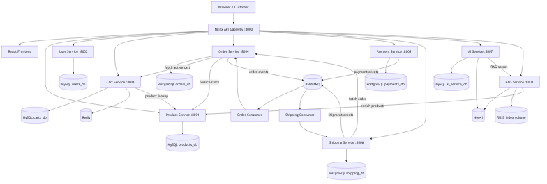

# System Architecture

> Updated to match the current project structure: React frontend, Nginx gateway, Django REST microservices, RabbitMQ events, MySQL/PostgreSQL data stores, Neo4j graph recommendations, and FAISS/OpenAI-backed RAG.

## Runtime Topology

The public entrypoint is the Nginx gateway on port `8000`. It serves the React frontend and routes `/api/*` paths to the owning service. Each Django service owns its own database schema and exposes simple REST endpoints. Cross-service operations use HTTP for request/response work and RabbitMQ for asynchronous domain events.

## Public Routing

| Public path | Upstream |
|---|---|
| `/` | `frontend:80` |
| `/api/products/`, `/api/categories/` | `product_service:8001` |
| `/api/auth/`, `/api/users/` | `user_service:8002` |
| `/api/carts/` | `cart_service:8003` |
| `/api/orders/` | `order_service:8004` |
| `/api/payments/` | `payment_service:8005` |
| `/api/shipping/` | `shipping_service:8006` |
| `/api/ai/chatbot/` | `rag_service:8008` |
| `/api/ai/` | `ai_service:8007` |

## Storage and Infrastructure

- MySQL stores product, user, cart, and AI behavior data.
- PostgreSQL stores order, payment, and shipping data.
- RabbitMQ carries order, payment, and shipping events between workers.
- Redis is provisioned for cache/session style use by the cart tier.
- Neo4j stores product/user behavior graph relationships for recommendations.
- FAISS stores product embedding indexes for RAG retrieval.

## Event Flow

- `order_service` publishes `order.created` and `order.cancelled`.
- `order_consumer` listens for payment/shipping events and updates order state.
- `payment_service` publishes `payment.completed`, `payment.failed`, and `payment.refunded`.
- `shipping_consumer` listens for `payment.completed` and creates shipments.
- `shipping_service` publishes `shipment.created` and `shipment.<status>`.

## AI/RAG Path

The AI service combines sequence-model scores, Neo4j graph scores, and RAG scores. The RAG service separately provides chatbot answers and internal RAG score retrieval by merging FAISS semantic search with Neo4j graph context. OpenAI generation is optional; when no key is configured, the chatbot falls back to a template answer from retrieved context.

