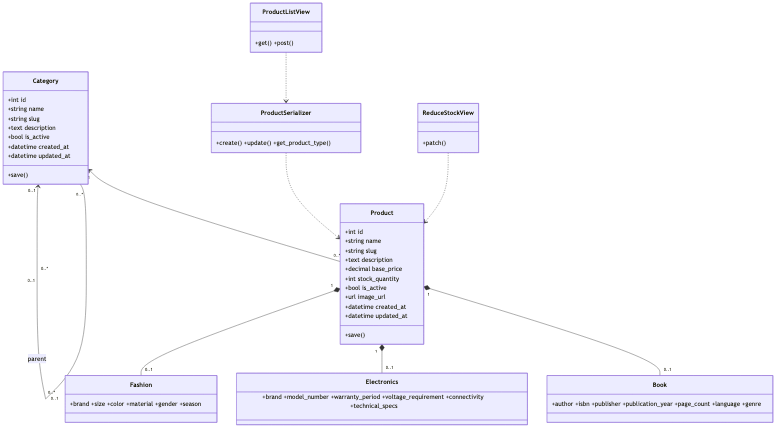

# Product Service Class Diagram

> Updated to match the current project structure: React frontend, Nginx gateway, Django REST microservices, RabbitMQ events, MySQL/PostgreSQL data stores, Neo4j graph recommendations, and FAISS/OpenAI-backed RAG.

Product service owns hierarchical categories, base product records, and optional subtype tables for books, electronics, and fashion.

The Mermaid source for this diagram lives in `docs/images/02-class-product.mmd`.

