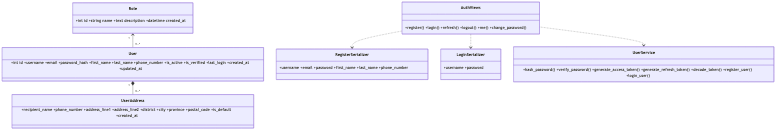

# User Service Class Diagram

> Updated to match the current project structure: React frontend, Nginx gateway, Django REST microservices, RabbitMQ events, MySQL/PostgreSQL data stores, Neo4j graph recommendations, and FAISS/OpenAI-backed RAG.

User service owns roles, users, addresses, password hashing, and JWT generation/validation helpers.

The Mermaid source for this diagram lives in `docs/images/03-class-user.mmd`.

