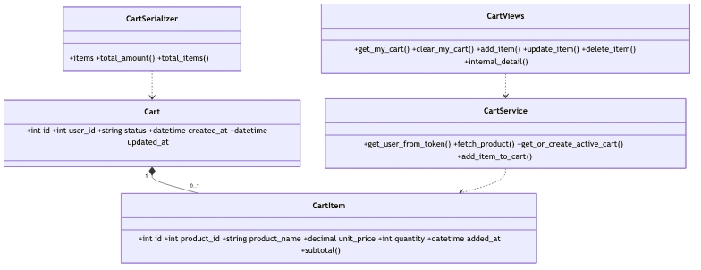

# Cart Service Class Diagram

> Updated to match the current project structure: React frontend, Nginx gateway, Django REST microservices, RabbitMQ events, MySQL/PostgreSQL data stores, Neo4j graph recommendations, and FAISS/OpenAI-backed RAG.

Cart service owns active carts and cart items. It validates products by calling Product Service before adding items.

The Mermaid source for this diagram lives in `docs/images/04-class-cart.mmd`.

