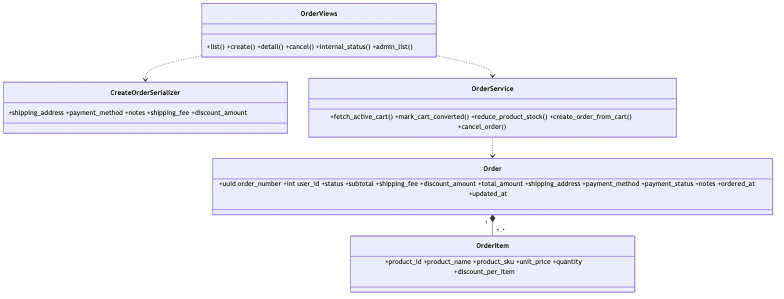

# Order Service Class Diagram

> Updated to match the current project structure: React frontend, Nginx gateway, Django REST microservices, RabbitMQ events, MySQL/PostgreSQL data stores, Neo4j graph recommendations, and FAISS/OpenAI-backed RAG.

Order service creates orders from the active cart, persists order items, reduces product stock, converts the cart, and emits order events.

The Mermaid source for this diagram lives in `docs/images/05-class-order.mmd`.

