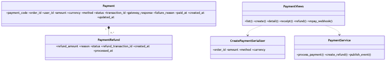

# Payment Service Class Diagram

> Updated to match the current project structure: React frontend, Nginx gateway, Django REST microservices, RabbitMQ events, MySQL/PostgreSQL data stores, Neo4j graph recommendations, and FAISS/OpenAI-backed RAG.

Payment service simulates gateway processing, stores payment/refund records, emits payment events, and handles VNPay webhook callbacks.

The Mermaid source for this diagram lives in `docs/images/06-class-payment.mmd`.

