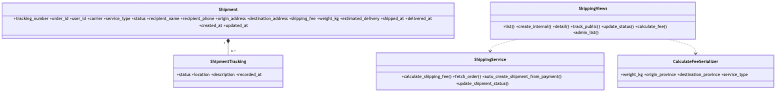

# Shipping Service Class Diagram

> Updated to match the current project structure: React frontend, Nginx gateway, Django REST microservices, RabbitMQ events, MySQL/PostgreSQL data stores, Neo4j graph recommendations, and FAISS/OpenAI-backed RAG.

Shipping service creates shipments, records tracking history, calculates fees, and auto-creates shipments after completed payment events.

The Mermaid source for this diagram lives in `docs/images/07-class-shipping.mmd`.

