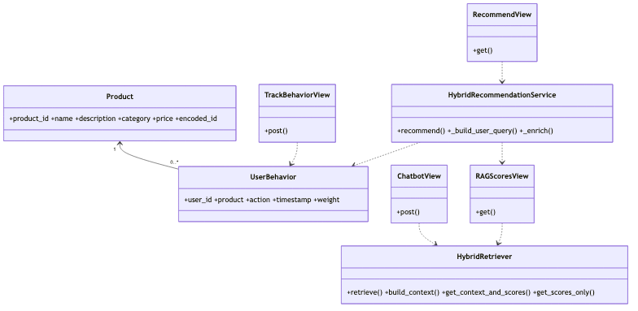

# AI and RAG Service Class Diagram

> Updated to match the current project structure: React frontend, Nginx gateway, Django REST microservices, RabbitMQ events, MySQL/PostgreSQL data stores, Neo4j graph recommendations, and FAISS/OpenAI-backed RAG.

AI Service tracks user behavior and blends recommendation signals from the active sequence model, Neo4j graph queries, and RAG scores. RAG Service builds chatbot context with dense FAISS semantic retrieval, sparse TF-IDF lexical retrieval, and Neo4j graph expansion, then generates an answer with OpenAI or a fallback template.
