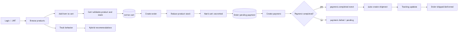
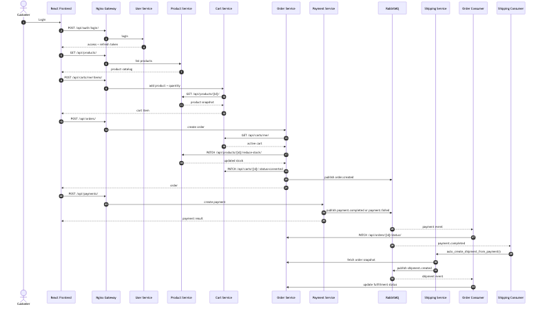

# Purchase Flow

> Updated to match the current project structure: React frontend, Nginx gateway, Django REST microservices, RabbitMQ events, MySQL/PostgreSQL data stores, Neo4j graph recommendations, and FAISS/OpenAI-backed RAG.

## Customer Checkout

1. Customer signs in through User Service and receives JWT access/refresh tokens.
2. Frontend loads products from Product Service through the gateway.
3. Cart Service creates or loads the customer's active cart.
4. Adding a cart item calls Product Service to validate product existence, active state, current price, and stock.
5. Order Service creates an order from the active cart, copies item snapshots, reduces Product Service stock, marks the cart `converted`, and publishes `order.created`.
6. Payment Service creates a payment and simulates processing. Non-COD payments usually complete immediately; COD remains pending until manual completion.
7. On `payment.completed`, Shipping Consumer creates a shipment and initial tracking event.
8. Shipping status updates publish shipment events; Order Consumer uses payment/shipping events to update order payment and fulfillment status.

## Sequence Diagram

## Failure Handling

- Empty cart: Order Service rejects order creation.
- Product not found/inactive/out of stock: Cart Service or Order Service rejects the operation.
- Payment failed: Payment Service publishes `payment.failed`; Order Service can mark payment status failed.
- Shipment status changes: only admins or internal callers can update protected status endpoints.

