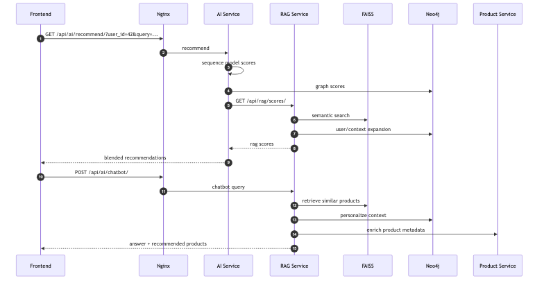
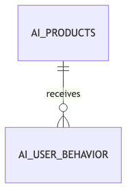

# AI Recommendation and RAG

> Updated to match the current project structure: React frontend, Nginx gateway, Django REST microservices, RabbitMQ events, MySQL/PostgreSQL data stores, Neo4j graph recommendations, and FAISS/OpenAI-backed RAG.


## Components

| Component | Location | Responsibility |
|---|---|---|
| Behavior app | `ai_service/apps/behavior` | Stores product metadata and user behavior events. |
| Recommendations app | `ai_service/apps/recommendations` | Combines sequence, graph, and RAG scores. |
| ML models | `ai_service/ml` | RNN, LSTM, BiLSTM, GRU, NARM, SASRec, and BERT4Rec implementations/training helpers. |
| Graph layer | `ai_service/graph`, `rag_service/graph` | Neo4j product/user behavior queries. |
| RAG retriever | `rag_service/rag` | FAISS semantic search, graph expansion, context building, answer generation. |
| Chatbot endpoint | `rag_service/apps/chatbot` | Public conversational product assistant. |
| RAG scores endpoint | `rag_service/apps/scores` | Internal scoring endpoint for AI Service. |

## Recommendation Formula

```text
final_score = w1 * sequence_score + w2 * graph_score + w3 * rag_score
```

Default Docker Compose weights:

- `LSTM_WEIGHT=0.4`
- `GRAPH_WEIGHT=0.35`
- `RAG_WEIGHT=0.25`

Weights passed as `w1`, `w2`, and `w3` are normalized before scoring.

## Behavior Tracking

`POST /api/ai/track/` stores one behavior event. Actions map to these weights:

| Action | Weight |
|---|---:|
| `view` | 1.0 |
| `click` | 2.0 |
| `add_to_cart` | 3.0 |
| `purchase` | 4.0 |

## RAG Retrieval

RAG Service combines:

1. FAISS semantic product search from the text query.
2. Neo4j graph scores for the user when `user_id` is provided.
3. Similar-product expansion from top FAISS hits through graph edges.
4. Product metadata enrichment through Product Service.

The chatbot uses retrieved context with OpenAI when `OPENAI_API_KEY` is present. Without an API key, it returns a deterministic fallback answer from the retrieved product context.

## Diagrams





